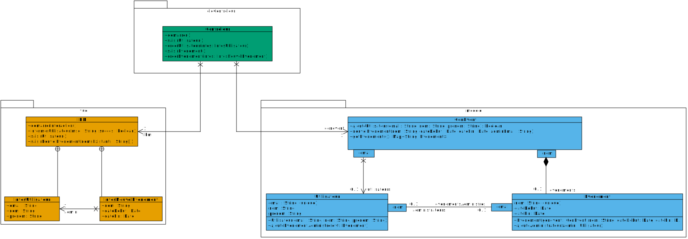

# GenEvent

## Organisation du dépôt

Le code fourni est distribué comme un module Java, regroupé dans le *package* racine `fr.uga.iut2.genevent`.

Le projet est configuré comme un projet [IntelliJ](https://www.jetbrains.com/fr-fr/idea/).
Les fichiers sources sont dans le dossier `src`, le dossier `persistence` est l'endroit où l'application stocke les données.


```console
$ tree -a -d -L 1 -I .git --gitignore --noreport -- genevent
genevent
├── doc
├── .idea
├── persistence
└── src
```


## Persistence des données

Un mécanisme de sérialisation (classe `genevent.util.Persisteur`) est fourni afin de rendre vos objets persistants.
Les états des objets sont stockés dans un fichier (flux binaire).
Pour qu'un objet puisse être sérialisé, il est nécessaire que sa classe implémente l'interface `java.io.Serializable`.
Seul les éléments du modèle doivent être conservés.

>>>
:warning: **ATTENTION**

À chaque fois que vous ajoutez/supprimez des attributs ou des classes, vous devez supprimer le fichier de sérialisation situé dans le dossier `persistence/`.
Si vous ne souhaitez pas supprimer le fichier, vous devez incrémenter l'attribut `serialVersionUID` de la classe modifiée.
>>>


## Structure du squelette de code fourni

Le squelette de code fourni suit le patron de conception MVC (Modèle, Vue Contrôleur) ainsi que représenté sur le diagramme de classe détaillé ci-après.
Les composants principaux du patron sont regroupés dans les *packages* respectifs `genevent.modele`, `genevent.vue` et `genevent.oldControleur`.



Dans cette implémentation, le contrôleur est l'objet qui pilote l'exécution de l'application comme représenté sur le diagramme de séquence ci-dessous.


Le diagramme de séquence détaillant la création d'un évènement illustre plus en détail l'interaction entre les différents objets de l'application et l'échange des informations.


### IHM

La classe `IHM` est une classe abstraite avec deux implémentations concrètes: `CLI` (interface en ligne de commande) et `JavaFXGUI` (interface graphique).
Les informations à destination du contrôleur sont structurées à l'aide des classes imbriquées `InfosUtilisateur` et `InfosNouvelEvenement`.


#### IHM, JavaFXGUI

>>>
:warning: **ATTENTION**

Afin de permettre au contrôleur de piloter l'exécution, la classe `JavaFXGUI` n'est pas une spécialisation de `javafx.application.Application`.
>>>

Le contrôleur démarre l'interface dans la méthode `JavaFXGUI#demarrerInteraction()`.
La spécification du comportement de l'interface est faite dans la méthode `JavaFXGUI#start(Stage)` (de manière classique).

Le squelette d'interface JavaFX fourni consiste en deux vues au format FXML (`main-view.fxml` et `new-user-view.fxml`).

Ces vues ne définissent pas de contrôleur JavaFX: le contrôleur est injecté à l'exécution pour utiliser l'objet créé par le contrôleur.
Le bout de code ci-après (extrait de l'implémentation fournie de la méthode `JavaFXGUI#start`) illustre cette différence.
```java
FXMLLoader mainViewLoader = new FXMLLoader(getClass().getResource("main-view.fxml"));
mainViewLoader.setController(this);  // injection du contrôleur à l'exécution
Scene mainScene = new Scene(mainViewLoader.load());
```
